# Hi, I'm Siarhei Burakouski
### Design Engineer • AI Product Maker • Vibecoder

I design and ship products end-to-end: design systems, AI-assisted workflows, and production web apps (Next.js). Focus — zero-to-one MVPs and B2B tools, from concept to deploy.

[Portfolio](https://siarheiburakouski.eskviz.com) · [LinkedIn](https://www.linkedin.com/in/siarheiburakouski/?locale=en) · [Telegram](https://t.me/siarheiburakouski) · [Eskviz](https://eskviz.com) · [Email](mailto:hello@eskviz.com)

  
  

---

<table>
  <tr>
    <td width="50%" valign="top">
      <h4>Languages & Frontend</h4>
      
      
      
      
      
      
      
    </td>
    <td width="50%" valign="top">
      <h4>Cloud & Backend</h4>
      
      
      
      
      
      
    </td>
  </tr>
  <tr>
    <td width="50%" valign="top">
      <h4>AI & Automation</h4>
      
      
      
      
      
      
    </td>
    <td width="50%" valign="top">
      <h4>APIs, Design & Systems</h4>
      
      
      
      
      
      
    </td>
  </tr>
</table>

---

<picture>
  <source media="(prefers-color-scheme: dark)" srcset="https://raw.githubusercontent.com/burakovski/burakovski/output/github-snake-dark.svg" />
  <source media="(prefers-color-scheme: light)" srcset="https://raw.githubusercontent.com/burakovski/burakovski/output/github-snake.svg" />
  
</picture>

---

  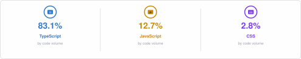

  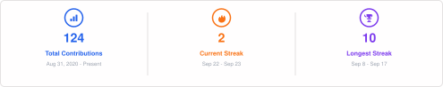

---

### Мои проекты

<table width="100%">
  <tr>
    <td width="50%" valign="top">
      <a href="https://sama.by">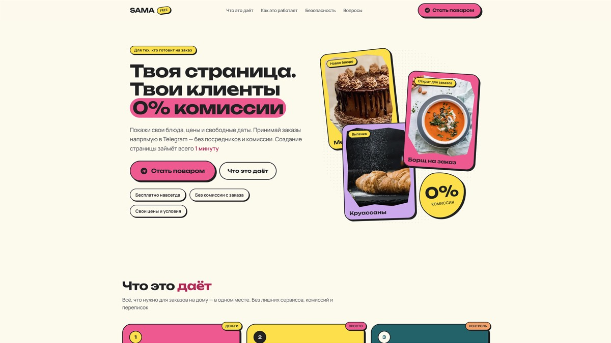</a>
      <h3><a href="https://sama.by">Sama.by</a></h3>
      
<strong>Platform for home chefs.</strong> Menu pages for Instagram, dish/filling builder, date calendar, orders into Telegram bot.

    </td>
    <td width="50%" valign="top">
      <a href="https://replybase.com">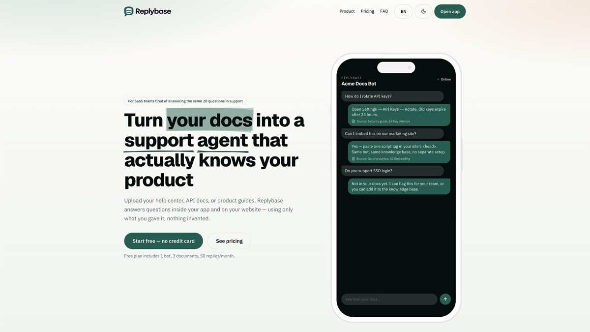</a>
      <h3><a href="https://replybase.com">ReplyBase</a></h3>
      
<strong>AI support SaaS.</strong> RAG chat over docs, website widget, processing, Telegram notifications.

    </td>
  </tr>
  <tr>
    <td width="50%" valign="top">
      <a href="https://voice-sync-ebon.vercel.app">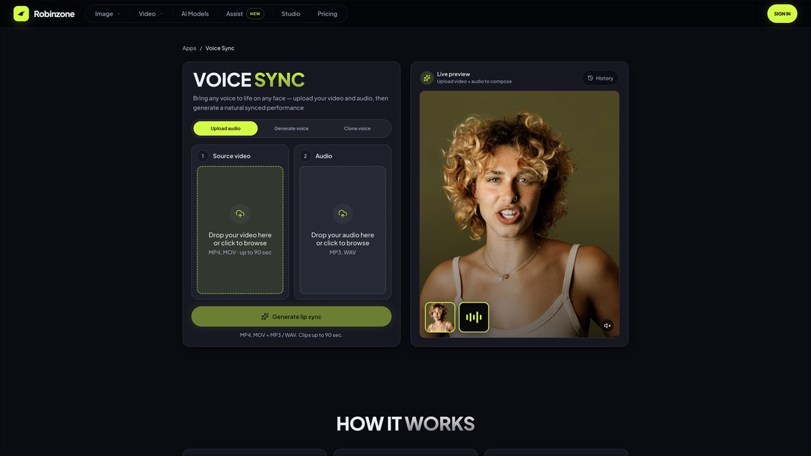</a>
      <h3><a href="https://voice-sync-ebon.vercel.app">Voice-Sync</a> MVP</h3>
      
<strong>AI lip-sync.</strong> Upload video + audio → natural synced facial performance.

    </td>
    <td width="50%" valign="top">
      <a href="https://eskviz.com">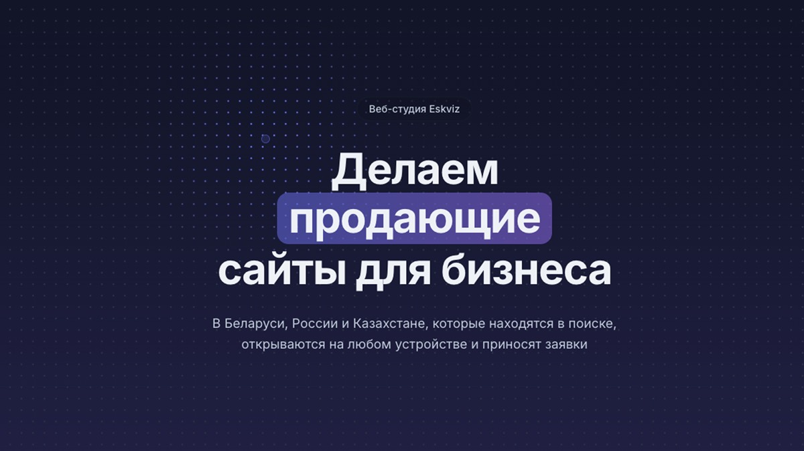</a>
      <h3><a href="https://eskviz.com">Eskviz Studio</a></h3>
      
<strong>AI web studio.</strong> Sites, e-com, chatbots, web services, SEO.

    </td>
  </tr>
  <tr>
    <td width="50%" valign="top">
      <a href="https://nsp.eskviz.com">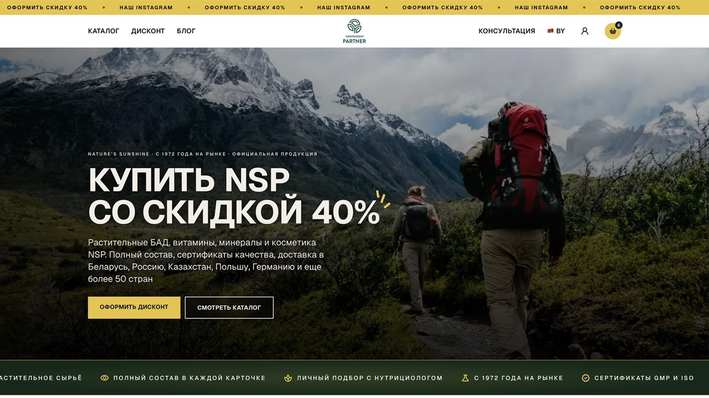</a>
      <h3><a href="https://nsp.eskviz.com">NSP Store</a></h3>
      
<strong>E-commerce.</strong> Catalog, filtering, discount forms, end-to-end analytics.

    </td>
    <td width="50%" valign="top">
      <a href="https://siarheiburakouski.eskviz.com">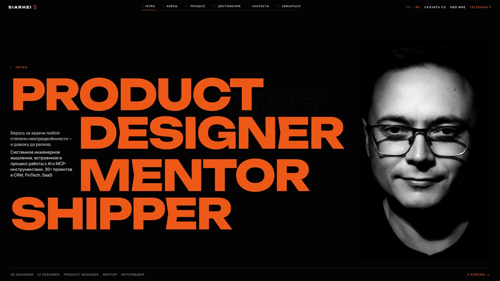</a>
      <h3><a href="https://siarheiburakouski.eskviz.com">Design Portfolio</a></h3>
      
<strong>Product design.</strong> Case studies, system thinking, interactive UI work.

    </td>
  </tr>
</table>

---

### Commercial / B2B

<table width="100%">
  <thead>
    <tr>
      <th align="left">Product</th>
      <th align="left">Domain</th>
      <th align="left">What I shipped</th>
    </tr>
  </thead>
  <tbody>
    <tr>
      <td>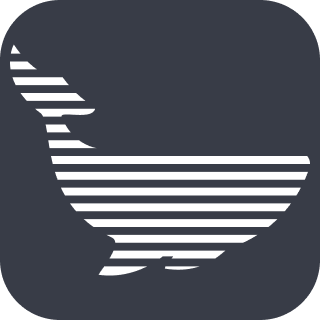 <strong><a href="https://kit.arbitrkit.ru">КИТ</a></strong></td>
      <td>LegalTech corporate</td>
      <td>Design, layout.</td>
    </tr>
    <tr>
      <td> <strong><a href="https://dreamsoft-kz-preview.vercel.app">DreamSoft KZ</a></strong></td>
      <td>Corporate web</td>
      <td>Design, layout.</td>
    </tr>
    <tr>
      <td> <strong><a href="https://igor-antikvar.kz">Игорь-Ереке</a></strong></td>
      <td>Landing</td>
      <td>Design, layout, domain &amp; hosting, analytics, SEO, semantic core, ads.</td>
    </tr>
    <tr>
      <td>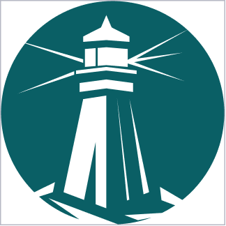 <strong><a href="https://app.arbitrkit.ru">Мой юрист</a></strong></td>
      <td>White-label portal</td>
      <td>Design, layout, analytics.</td>
    </tr>
    <tr>
      <td>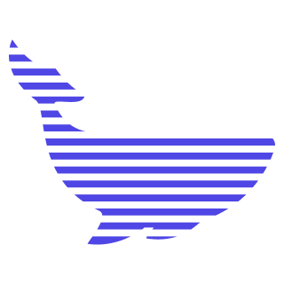 <strong><a href="https://arbitrkit.com">CRM КИТ</a></strong></td>
      <td>LegalTech SaaS</td>
      <td>Design.</td>
    </tr>
  </tbody>
</table>
